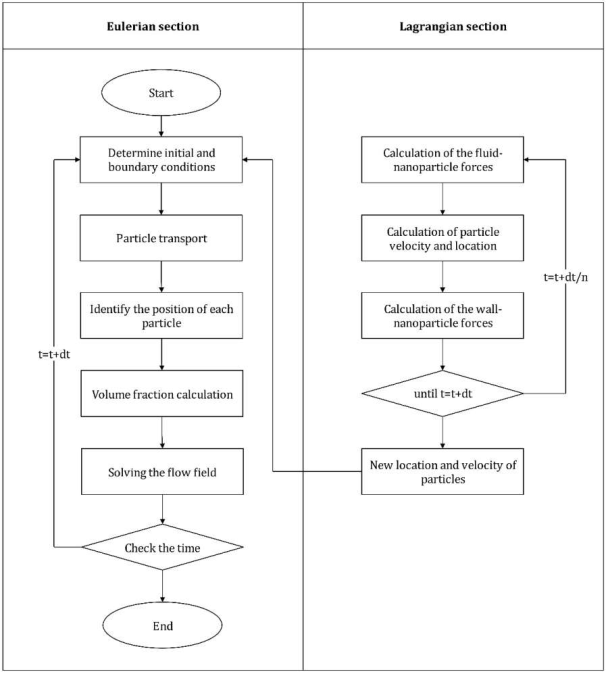
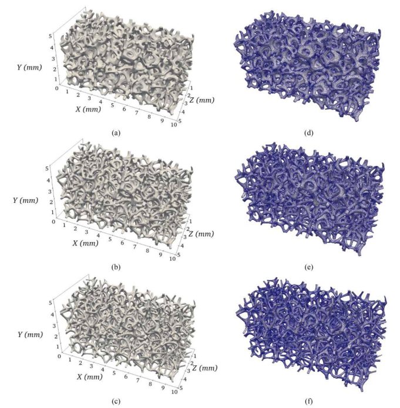
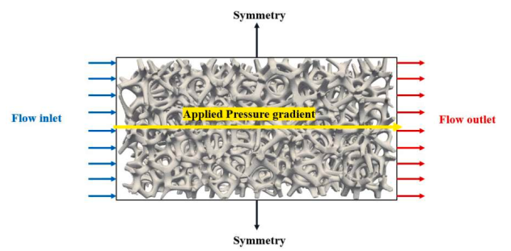

# ELWallFoam

OpenFOAM solver for pore-scale Eulerian-Lagrangian simulation of nanoparticle transport and deposition in porous media.

---

## 📌 Overview

This repository provides a custom OpenFOAM solver (`ELWallFoam`) for simulating nanoparticle transport and deposition in porous media using an Eulerian–Lagrangian (EL) framework.

The solver resolves:
- Fluid flow (Eulerian phase)
- Particle transport (Lagrangian phase)
- Particle–fluid and particle–surface interactions

Key physical mechanisms included:
- Drag force
- Brownian motion
- Saffman lift force
- Gravity and buoyancy
- Van der Waals (VDW) interactions
- Electrostatic double-layer (EDL) forces

---

## 🔬 Physical Model

The solver is designed for pore-scale simulations in porous media such as:
- Open-cell metal foams (OCMF)
- Sandstone (e.g., Berea)

---

## 🧠 Numerical Approach

- Finite Volume Method (FVM)
- Eulerian–Lagrangian coupling
- SIMPLE algorithm

---

## 📁 Repository Structure

```
solver/
    ELWallFoam/
tutorials/
    caseName/
related_papers/
figures/
README.md
CITATION.cff
.gitignore
LICENSE
```

---

## ⚙️ Installation

```bash
source /path/to/OpenFOAM-7/etc/bashrc
cd solver/ELWallFoam
wmake
```

---

## ▶️ Running a Case

```bash
cd tutorials/caseName
ELWallFoam
```

---

## 📊 Example Results

### 🧩 Computational Workflow


### 🧱 Porous Media Geometry


### 🔲 Boundary Conditions


### 🌡️ Nanoparticle Deposition Behavior


---

## 📚 Reference

Ramezanpour et al. (2024)  
Transport and deposition of nanoparticles in porous media at the pore scale using an Eulerian-Lagrangian method.

---

## 👤 Author

Hamidreza Khoshtarash  
PhD Student – UC Davis
